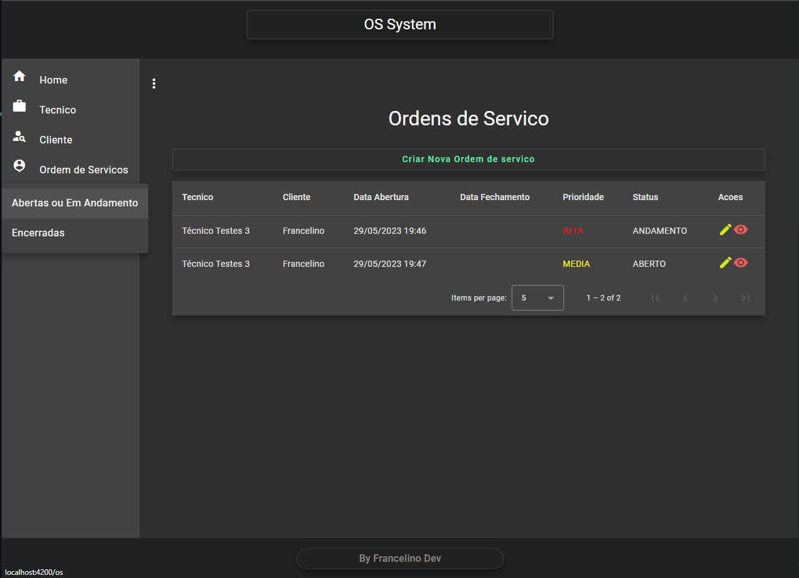

# OrdemServico

---

## Indice

- [OrdemServico](#OrdemServico)
    - [Indice](#indice)
    - [Sobre](#sobre)
    - [Aplicação exemplo](#aplicação-exemplo)
    - [Funcionalidade da Aplicação](#funcionalidade-da-aplicação)
    - [Tecnologias utilizadas](#tecnologias-utilizadas)
    - [Como baixar o projeto](#como-baixar-o-projeto)
    - [Autor](#autor)

---

## Sobre

O Projeto **OrdemServico** foi desenvolvido seguindo o curso em um canal do youtube (https://www.youtube.com/@CodeCastleProgramming/playlists) para estudo de frontend com Angular 16 que faz consumo de uma API desenvolvida com Java e spring boot. O sistema gerencia clientes e tecnicos com ordens de servicos. com CRUD para clientes, tecnicos e ordem de servico.


---

## Funcionalidade da Aplicação

A aplicação exemplo consiste em:
- Criar, listar, editar e excluir clientes e tecnicos;
- Criar, listar e editar ordem de servicos;
- Validacao de formularios com mensagens que vem do backend;

---

## Aplicação exemplo

<h1>
  
</h1>
<h1>
  
</h1>
<h1>
  
</h1>
<h1>
  
</h1>
<h1>
  
</h1>
<h1>
  
</h1>
<h1>
  
</h1>

---

## Tecnologias utilizadas

O projeto foi desenvolvido utilizando as seguintes tecnologias
- Angular 16
- Angular Material 
- TypeScript
- CSS
- HTML5

---

## Como baixar o projeto

```bash
# Clonar o repositório em sua máquina 
$ git clone https://github.com/francelinom/ordem-servico.git

# Entrar na pasta do projeto 
$ cd ordem-servico

# Rodar o comando
$ npm install

# Rodar o comando para iniciar o projeto
$ ng serve

# Abrir na porta
$ http://localhost:4200/

```
---
## Autor

Desenvolvido por **Francelino Marcílio da Silva** - Dev FullStack
<h1>
  
</h1>